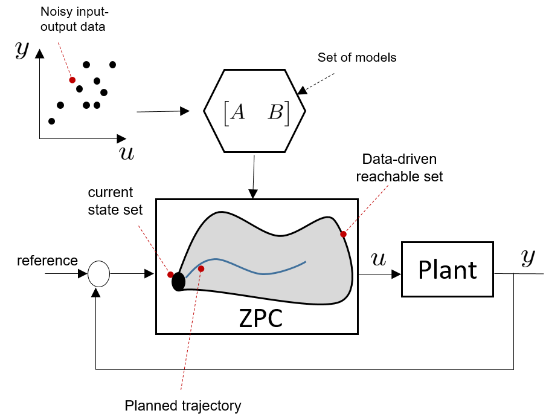

## Robust Data-Driven Predictive Control using Reachability Analysis
<br /> 
This repo cotains the code for our paper:<br /> 
[1] Amr Alanwar*, Yvonne Stürz*, Karl Johansson "Robust Data-Driven Predictive Control using Reachability Analysis" <br />


We present a robust data-driven control scheme for unknown linear systems with a bounded process and measurement noise. Instead of depending on a system model as in traditional predictive control, a controller utilizing a data-driven reachable region is proposed. The data-driven reachable regions are based on a matrix zonotope recursion and are computed based on only noisy input-output data of the system's trajectory. We assume measurement and process noise which are contained in bounded sets. While we assume knowledge of these bounds, no knowledge about the statistical properties of the noise is assumed. Our proposed scheme guarantees robust constraint satisfaction under measurement and process noise, which is essential in safety-critical applications.<br />

<br /> <br />
<p align="center">

</p>

## Running 
1- Download [MPT](https://www.mpt3.org) and install [mosek](https://www.mosek.com/products/academic-licenses/) toolboxs.<br />
2- Add MPT folder and subfolders to the Matlab path.  <br />
3- run ZPC.m.<br />
4- run Robust_MPC_polytopes.m.<br />
5- run plotPolyZono.m <br />

Our paper Bibtex is as follows:<br />
```
@article{ZPC,
  title={Robust Data-Driven Predictive Control using Reachability Analysis},
  author={Alanwar, Amr and Stürz, Yvonne and Johansson, Karl Henrik},
  journal={arXiv preprint},
  year={2021}
}
```
